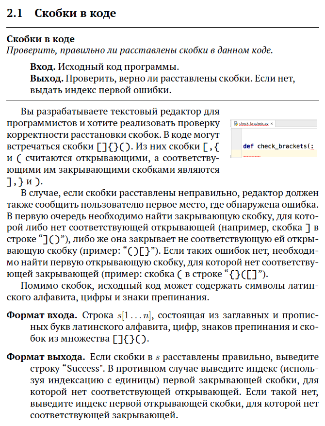
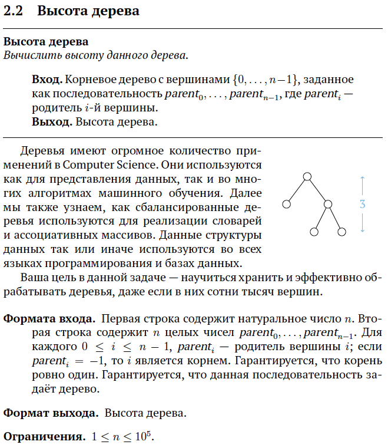

> Решение задач курса [Алгоритмы: теория и практика. Структуры данных](https://stepik.org/course/1547/).

## 1. Базовые структуры данных

### [Степ 1](https://stepik.org/lesson/41234/step/1)

<strong>Условие задачи</strong>

[Решение](lesson-41234/step-1/main.go), [тесты](lesson-41234/step-1/main_test.go).

### [Степ 2](https://stepik.org/lesson/41234/step/2)

<strong>Условие задачи</strong>

[Решение](lesson-41234/step-2/main.go), [тесты](lesson-41234/step-2/main_test.go).
