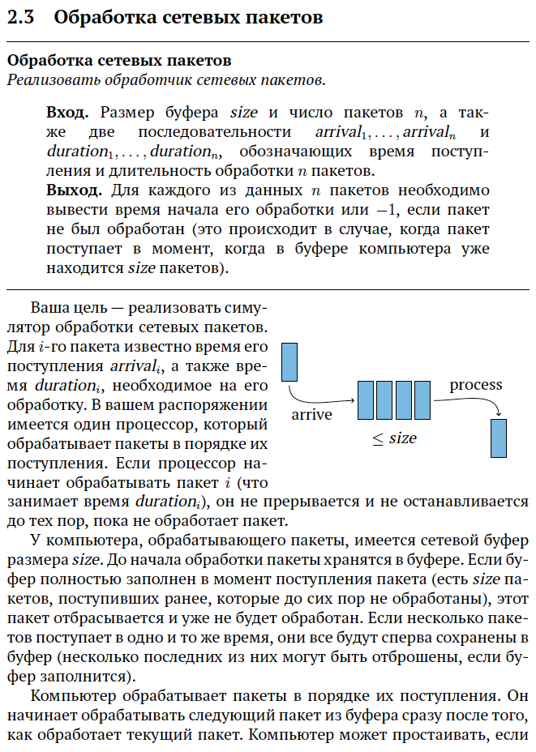
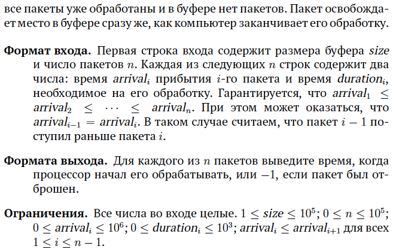
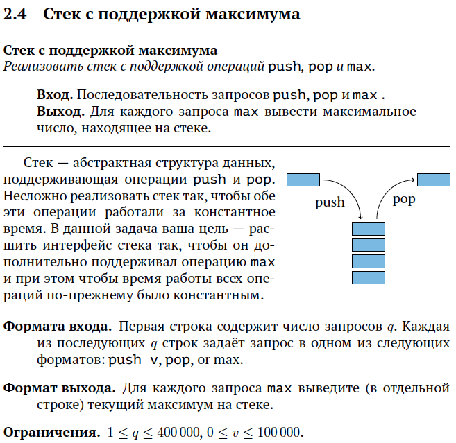
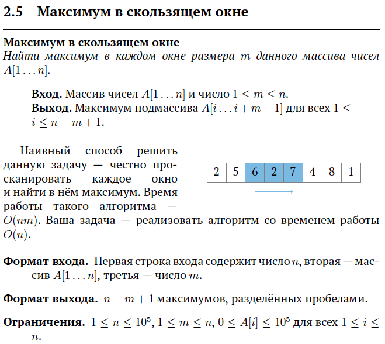
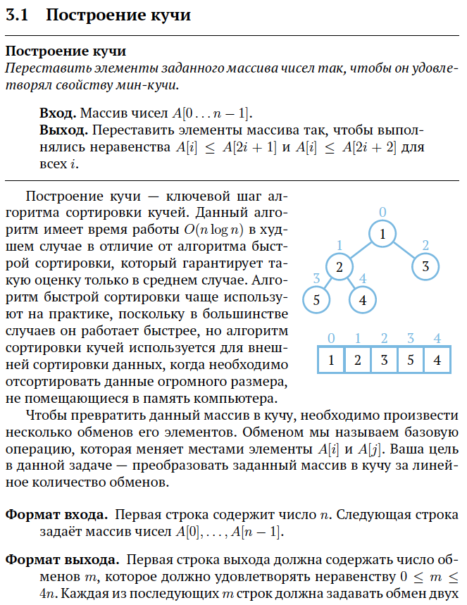
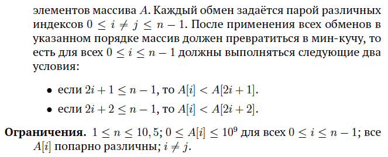

> Решение задач курса [Алгоритмы: теория и практика. Структуры данных](https://stepik.org/course/1547/).

## 1. Базовые структуры данных

### [Степ 1](https://stepik.org/lesson/41234/step/1)

<strong>Условие задачи</strong>

[Решение](lesson-41234/step-1/main.go), [тесты](lesson-41234/step-1/main_test.go).

### [Степ 2](https://stepik.org/lesson/41234/step/2)

<strong>Условие задачи</strong>

[Решение](lesson-41234/step-2/main.go), [тесты](lesson-41234/step-2/main_test.go).

### [Степ 3](https://stepik.org/lesson/41234/step/3)

<strong>Условие задачи</strong>

[Решение](lesson-41234/step-3/main.go), [тесты](lesson-41234/step-3/main_test.go).

### [Степ 4](https://stepik.org/lesson/41234/step/4)

<strong>Условие задачи</strong>

[Решение](lesson-41234/step-4/main.go), [тесты](lesson-41234/step-4/main_test.go).

### [Степ 5](https://stepik.org/lesson/41234/step/5)

<strong>Условие задачи</strong>

[Решение](lesson-41234/step-5/main.go), [тесты](lesson-41234/step-5/main_test.go).

## 2. Очереди с приоритетами

### [Степ 1](https://stepik.org/lesson/41560/step/1)

<strong>Условие задачи</strong>

[Решение](lesson-41560/step-1/main.go), [тесты](lesson-41560/step-1/main_test.go).
