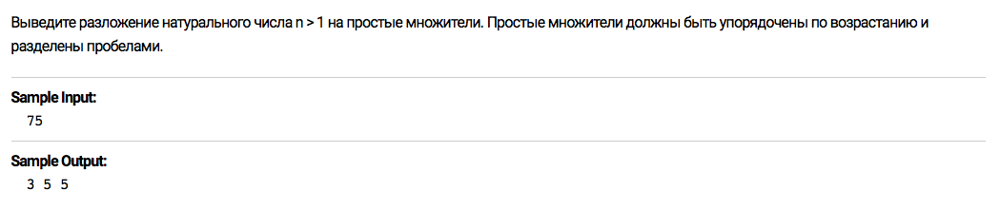
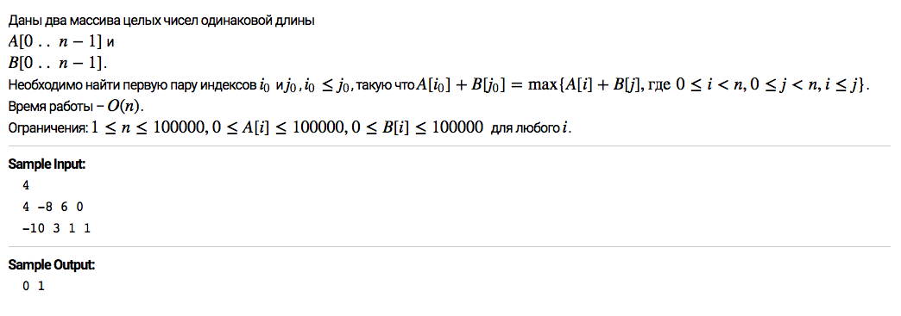
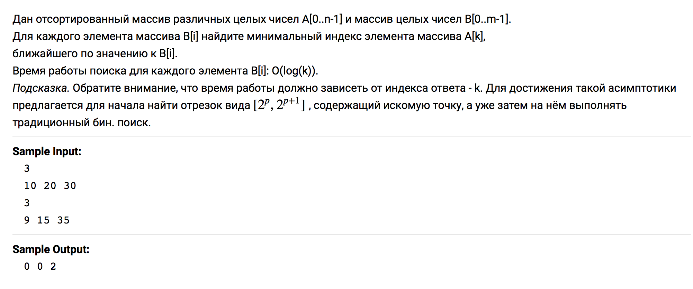
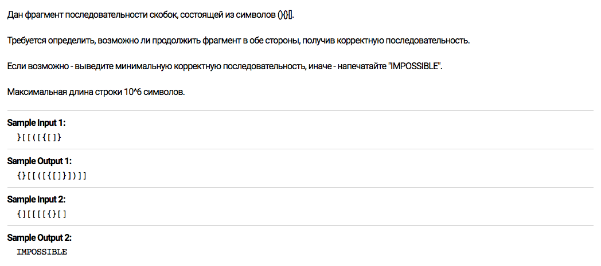

> Решение задач курса [Алгоритмы и структуры данных](https://stepik.org/course/156/).

## 1.2 Обзор алгоритмов. Первые шаги. Сложность алгоритмов

### [Степ 11](https://stepik.org/lesson/12555/step/11)

<strong>Условие задачи</strong>

[Решение](lesson-12555/step-11.go)

## 1.3 Массивы. Линейный и бинарный поиск. Амортизационный анализ

### [Степ 3](https://stepik.org/lesson/12556/step/3)

<strong>Условие задачи</strong>

[Решение](lesson-12556/step-3.go)

### [Степ 7](https://stepik.org/lesson/12556/step/7)

<strong>Условие задачи</strong>

[Решение](lesson-12556/step-7.go)

## 2.1 Списки. Очередь, стек, дек

### [Степ 7](https://stepik.org/lesson/12559/step/7)

<strong>Условие задачи</strong>

[Решение](lesson-12559/step-7.go)

### [Степ 8](https://stepik.org/lesson/12559/step/8)

<strong>Условие задачи</strong>

[Решение на Go](lesson-12559/step-8.go)[1](#12559-8), [решение на Python](lesson-12559/step-8.py)

1 решение на Go не проходит `test #19`, но это же решение,
переписанное на Python такой проблемы не имеет. [↩](#anchor-12559-8)
