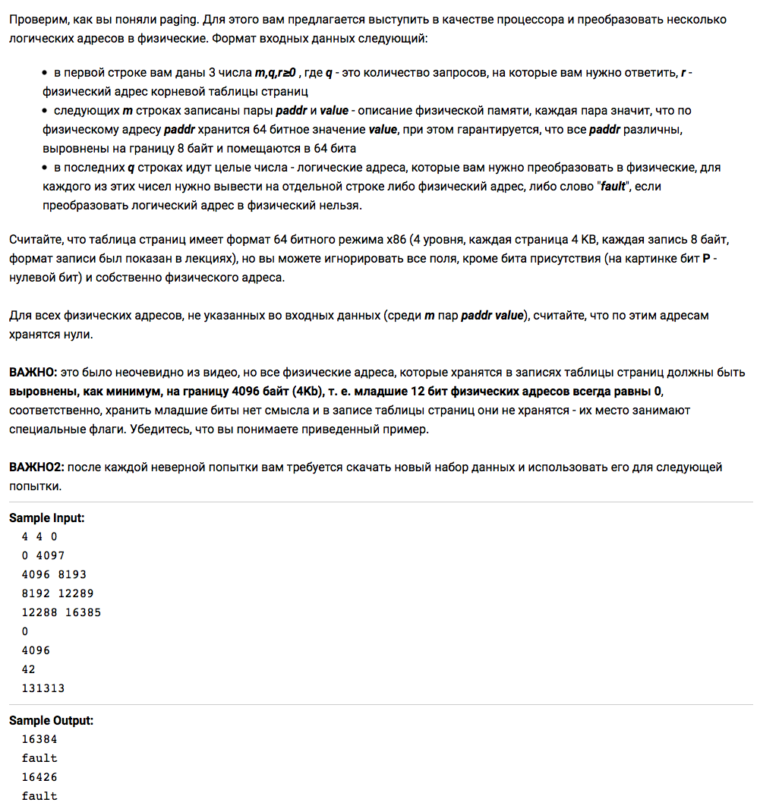

> Решение задач курса [Операционные системы](https://stepik.org/course/1780/).

## 2.4 Страничная организация памяти

### [Степ 15](https://stepik.org/lesson/44327/step/15)

[Решение](lesson-44327/step-15.go)
